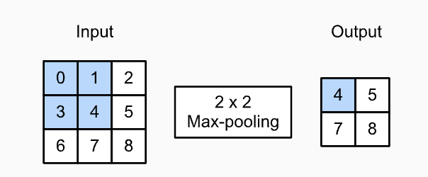
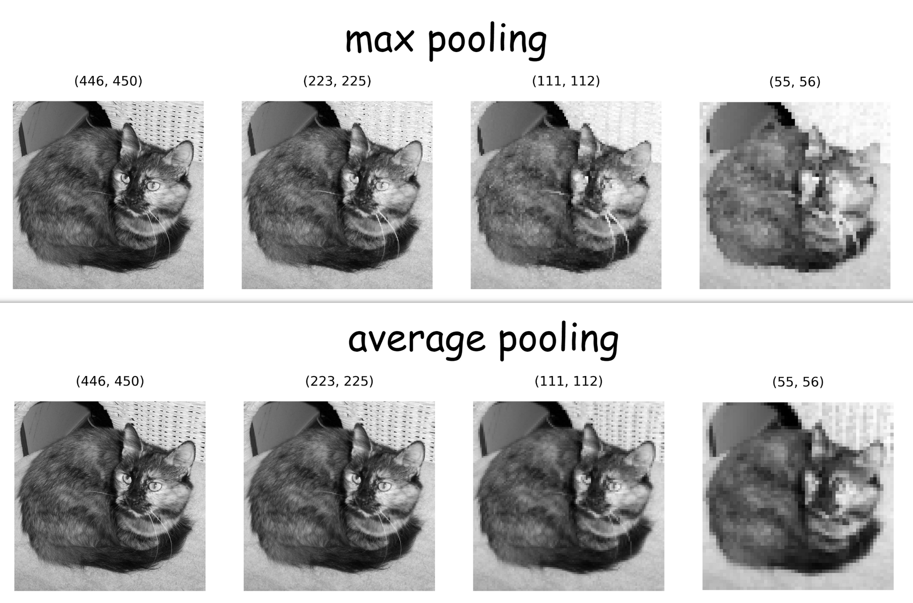

#### Pooling

Pooling, as shown in the image below, is reducing the size of a matrix in favor of a predefined value. here the favored value is the biggest hence the 'Max' in MaxPooling

- Max Pooling 2 * 2:


Applied on an image, it gives the following result:

- MaxPooling and AveragePooling on an image of a cat:


This technique has the effect of reducing the information by keeping the most points for training.

#### Convolution
Convolution of an image is simply taking a Matrix V with predefined values
( in our example:
```
    [ 0 1 2 ]                 
V = [ 2 2 0 ]    
    [ 0 1 2 ]   

```

)  
and multiplying it with parts of the input image's pixels. We take a 3 * 3 corner of the pixels matrix (also called a kernel), as the mask (convolution mask) is also of size 3 * 3.
Here is an illustration:

This technique has the effect of isolating the features on an image (example: soles on a shoe, strap on a handbag) which makes it easier to spot commona traits of an item.

The above 2 techniques will be combined to improve the training of our DNN (Deep Neural network). These are the basics of a CNN (Convolutional Neural Network).


#### Learning Objectives
- Use callback functions to interrupt training after meeting a threshold accuracy
- Test the effect of adding convolution and MaxPooling to the neural network for classifying Fashion MNIST images on classification accuracy
- Explain and visualize how convolution and MaxPooling aid in image classification tasks