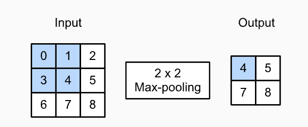
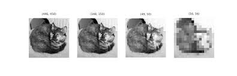

#### Pooling

Pooling, as shown in the image below, is reducing the size of a matrix in favor of a predefined value. here the favored value is the biggest hence the 'Max' in MaxPooling

- Max Pooling 2 * 2:

Applied on an image, it gives the following result:

- MaxPooling on an image of a cat:

#### Learning Objectives
- Use callback functions to interrupt training after meeting a threshold accuracy
- Test the effect of adding convolution and MaxPooling to the neural network for classifying Fashion MNIST images on classification accuracy
- Explain and visualize how convolution and MaxPooling aid in image classification tasks