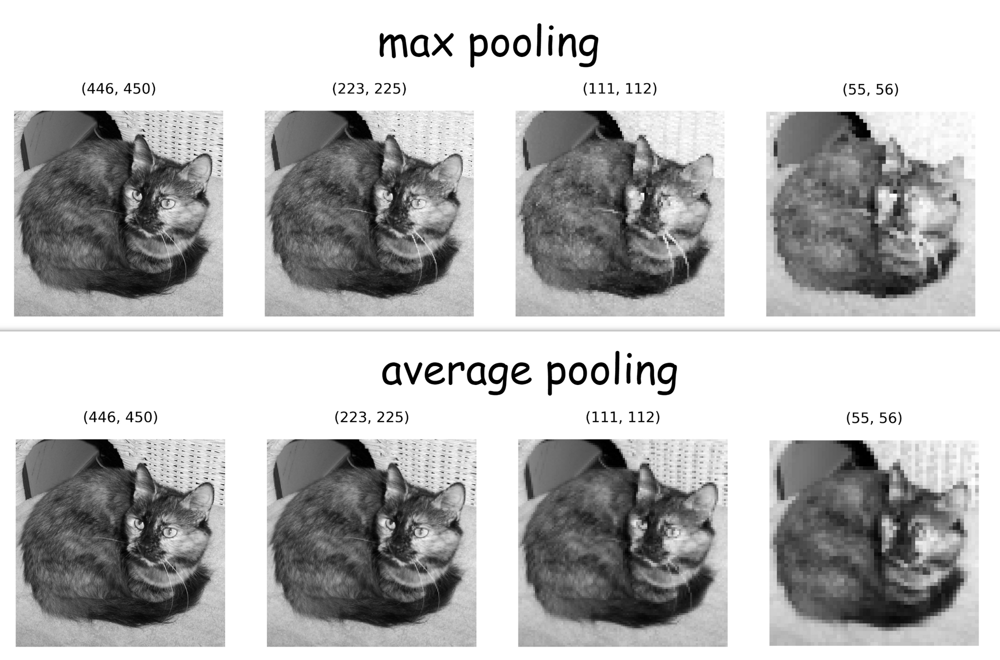
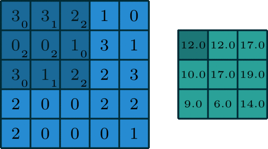

#### Pooling

Pooling, as shown in the image below, is reducing the size of a matrix in favor of a predefined value. here the favored value is the biggest hence the 'Max' in MaxPooling

- Max Pooling 2 * 2:

Applied on an image, it gives the following result:

- MaxPooling and AveragePooling on an image of a cat:

#### Convolution
Convolution of an image is simply taking a Matrix v with predefined values
( in our example:
'''\Conv2D{v} = \begin{bmatrix} 0 1 2 \\\ 2 2 0 \\\ 0 1 2 \end{bmatrix} '''
)
and multiplying it with parts of the input image equal to the size of the Matrix v (also called a kernel), here 3 * 3.
Here is an illustration:

The above 2 techniques will be combined to improve the training of our DNN (Deep Neural network). These are the basics of a CNN (Convolutional Neural Network).

#### Learning Objectives
- Use callback functions to interrupt training after meeting a threshold accuracy
- Test the effect of adding convolution and MaxPooling to the neural network for classifying Fashion MNIST images on classification accuracy
- Explain and visualize how convolution and MaxPooling aid in image classification tasks